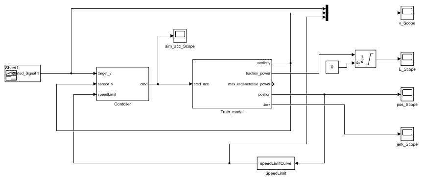
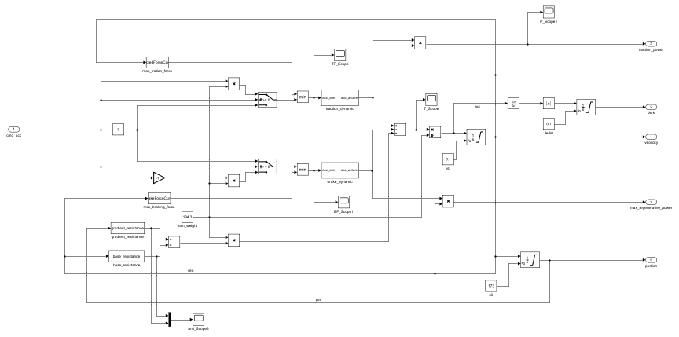
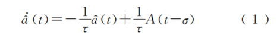
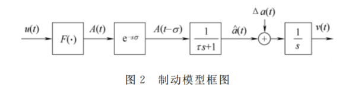
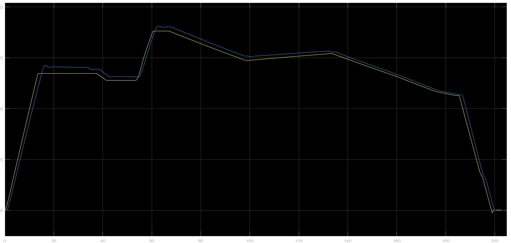
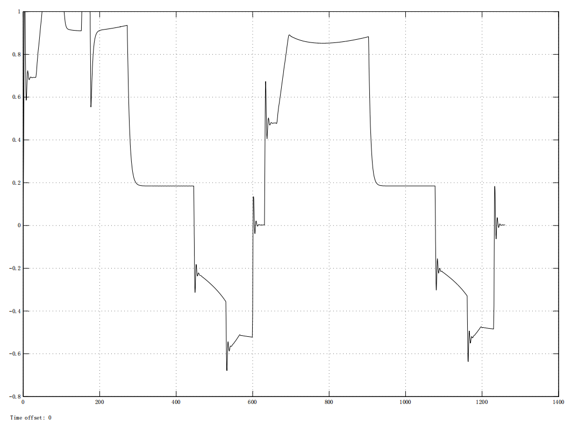

# 基于simulink的城市轨道交通列车控制仿真平台

### 1. 平台总览

全局结构

列车动力学模型

### 2. 列车系统仿真平台的参数

σ＝１．２ｓ， τ＝０．４ｓ。τ为系统响应时间常数； σ为传输延时。

### 3. 运行效果

列车速度曲线

列车加速度曲线

### 4. 参考文献

陈德旺. 城轨列车智能驾驶的优化模型及算法[M]. 北京交通大学出版社, 2014.

### 5. 联系方式
1036522761@qq.com